# Paper Mario Randomizer Map Tracker for Emotracker

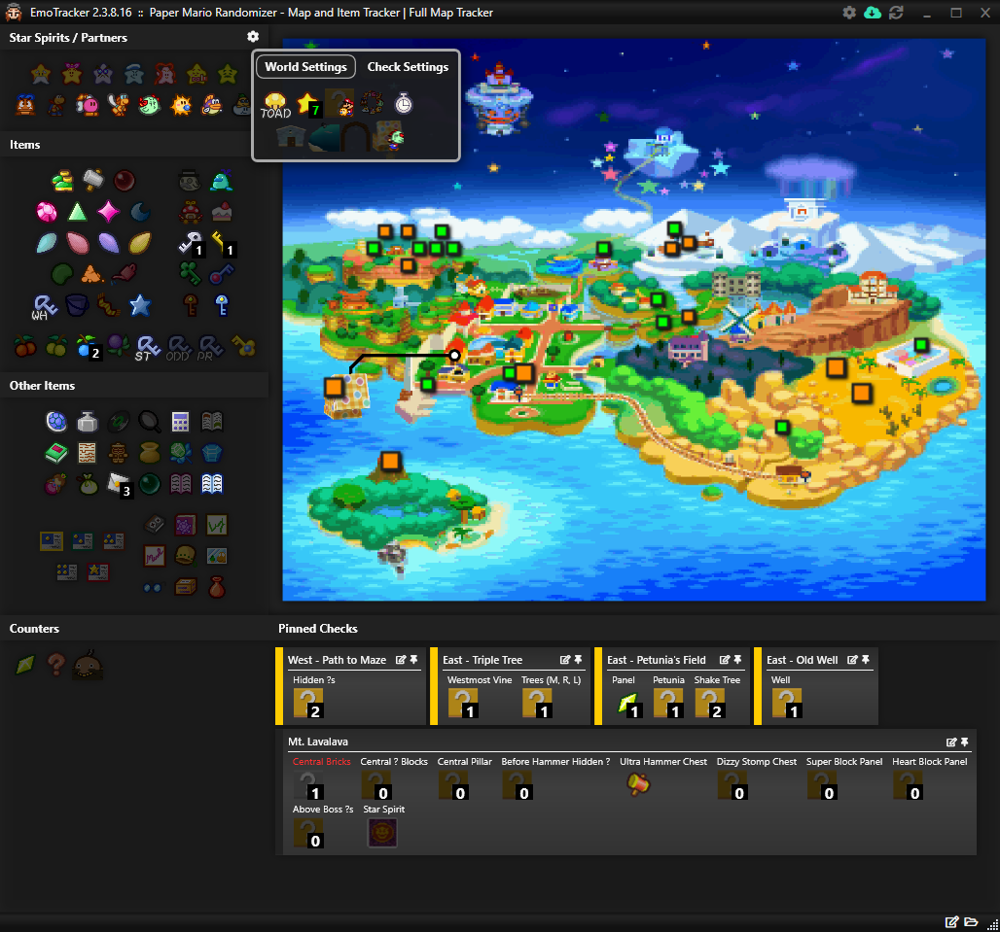

---

## Beginning A Seed
The gear icon in the "Star Spirits / Partners" header allows you to configure the tracker to match your seed's settings.
### World Settings
- 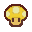 Starting Location - DEFAULT: `TOAD`
  - The Homeward Shroom icon sets where your seed begins.  This is used to set checks for ring 0.  Cycles between Toad Town (`TOAD`), Goomba Village (`GOOM`), Dry Dry Outpost (`DRY`), and Yoshi Village (`YOSHI`).
- 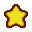 Required Star Spirits - DEFAULT: 7
  - The star icon sets how many Star Spirits are required to access Star Way.  Left-click to increase, right-click to decrease.
-  Hidden Block Watt Requirement - DEFAULT: Watt Required
  - The Hidden ? Block icon sets whether or not you need Watt to see hidden ? blocks.  When Watt is required to see hidden blocks, a small image of Mario holding Watt will appear in the bottom right.
- 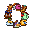 Partner Abilities Always Active - DEFAULT: Not Active
  - The partner circle icon sets whether or not partner abilities are always active.  Full brightness means that partner abilities are always active, while a dulled icon means the player must find the partner before they may use the partner's ability.
- 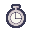 Fast Bowser's Castle - DEFAULT: Fast
  - The stopwatch icon sets whether or not fast Bowser's Castle is enabled.  Full brightness means that Bowser's Castle will be significantly shortened, while a dulled icon means that Bowser's Castle will be the full length.
- 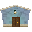 Open Blue House - DEFAULT: Locked
  - The Blue House icon sets whether or not the Blue House is unlocked by default.  Bombette is still required to progress past Rip Cheato's room.  Full brightness means the Blue House is unlocked, while a dulled icon means the player must unlock the Blue House themselves.
- 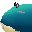 Open Whale - DEFAULT: Must Fight Fuzzipede
  - The Whale icon sets whether or not Mario can ride the Whale from the start in Toad Town Docks. Full brightness means Mario can ride the Whale, while a dulled icon means that the player must wake the Whale and use Watt to start the Fuzzipede encounter.
- 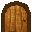 Open Flower Fields - DEFAULT: Closed
  - The door icon sets whether or not Flower Fields is open at the start.  A full brightness closed door indicates Flower Fields is unlocked at the start, while a dulled door frame means the player must collect the 4 Magical Seeds to unlock Flower Fields.
- 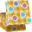 Open Toybox - DEFAULT: Bow Required
  - The toybox icon sets whether or not Bow is required to access Shy Guy's Toybox.  When Bow is required, a small image of mario behind Bow will appear in the bottom right.

### Check Settings
- 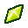 Shuffle Panels - DEFAULT: Off
  - Sets whether to include panels in check locations.  A full brightness icon indicates panels are shuffled into logic, while a dulled icon means they are not.
- 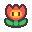 Shopsanity - DEFAULT: Off
  - Sets whether or not to include Shops.  A full brightness icon means shops are in logic, while a dulled icon means they are not.
- 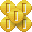 Coinsanity - DEFAULT: Off
  - Sets whether or not to include freestanding coins and coin only ? blocks in logic.  A full brightness icon means all freestanding coins and coin ? blocks are in logic, while a dulled icon means they are not.
- 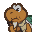 [*NOT IMPLEMENTED*] Shuffle Koopa Koot Rewards - Default: Off
  - Sets whether or not to include Koopa Koot fetch quest rewards in logic.  A full brightness icon means the rewards are in logic, while a dulled icon means they are not.
- 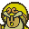 Shuffle Dojo Rewards - DEFAULT: Off
  - Sets whether or not to include the Toad Town Dojo rewards in logic.  A full brightness icon means Dojo rewards are shuffled into logic, while a dulled icon means they are not.
